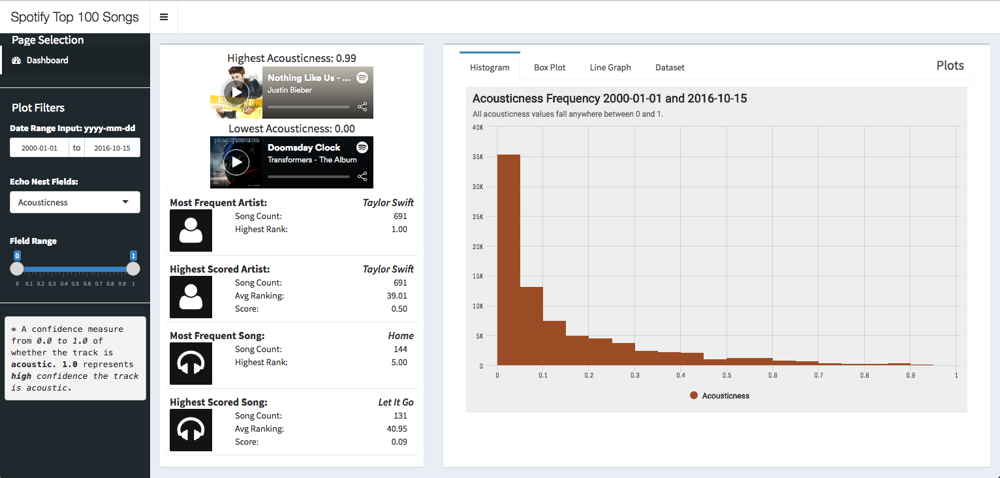
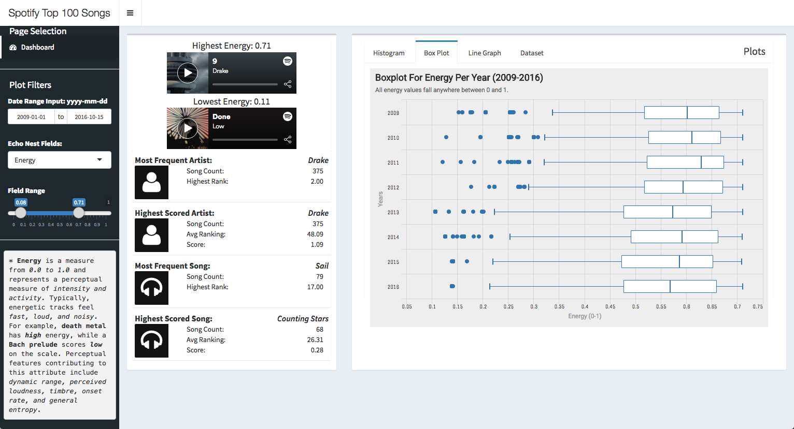

# Trends in Billboards Top Ranked Songs

The purpose of this app is to spot trends within the top ranked songs (based on the **unofficial** billboards api)
from every week over the span of 2000 - 2017 using Spotify's audio analysis api, specifically features extracted from [Echonest](http://static.echonest.com/enspex/)

I do this by first obtaining songs, dates, and their ranks through the billboards api. Second, I gather a high level overview of the song's audio features, especially focussing on some key features defined by Echonest through the Spotify API. These features include the following, and definitions can be found [here](https://developer.spotify.com/documentation/web-api/reference/tracks/get-audio-features/#audio-features-object): 

* Danceability
* Energy
* Speechiness
* Acousticness
* Instrumentalness
* Valence

The goal of this app was to create a dashboard to allow the user to explore this featureset and how each feature correlates with the rank of the song on a week to week basis, if at all. 

This is the overall view of the dashboard, hopefully it is pretty self-explanatory! But if not..
As you can see on the left, there are some different filters you can apply across the dataset. You are able to manipulate the filters in any way you would like, and all of the graphs form to the filtering. Some features you can incorporate: 

* Date Ranges (2000 - 2017)
* Echo Nest Fields as described above
* A Field Range (Each echonest value is a number between 0 and 1 describing the likelihood it sounds as so.)

I also include definitions for every echonest field directly below for clarity. As you filter, you will be able to get examples of songs that are highest and lowest of the spectrum that you choose, that way you have a better understanding of what it means to be __highly acoustic__ or not. The example above shows Justin Bieber's "Nothing Like Us" as the highest acoustic song for that filter as defined by Spotify / Echonest. The inverse is the song "Doomsday Clock" by the Transformers album soundtrack. Below you see the song "9" as being the highest energy song for that specific filter at `0.71` with the filters being `0.08-0.71`, and the inverse is "Done" by Low. 

This dashboard allows for some additional insights to be drawn out, including the most frequent artist or song, or the highest scored artist or song. You also have the ability to pull data from graphs displaying the correlation between rank and echonest field, the year and field, or the avg field level over any given week, as represented in the video below. 

  

